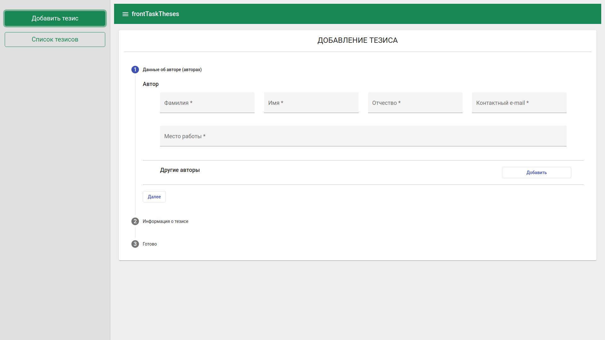
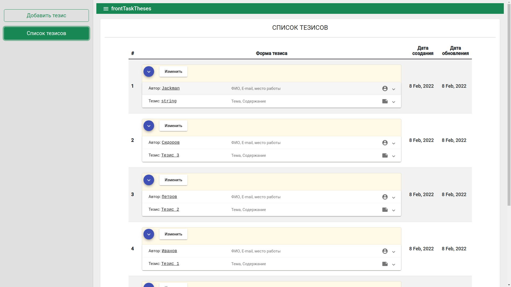

# FrontTask

Для имитации взаимодейтсвия с БД (сервером) был использован [JSON Server](https://github.com/typicode/json-server#getting-started)

>Инструкция по запуску приложения
(предварительно установить node.js | Angular CLI)
1) В корне проекта запутить терминал и выполнить следующие команды:
```
npm install
npm install -g json-server
json-server --watch db.json --routes routes.json
```
2) Открыть ещё один терминал в корне проекта и выполнить команду:
```
ng serve --open
```


>В корне проекта лежит файл <b>db.json</b> - он и будет условной БД.

>Наша БД будет доступна по ссылке http://localhost:3000/

##СКРИНЫ


